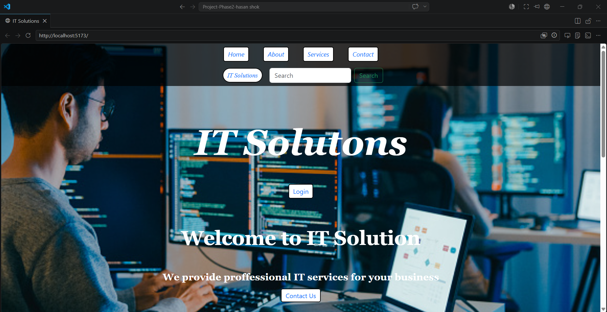
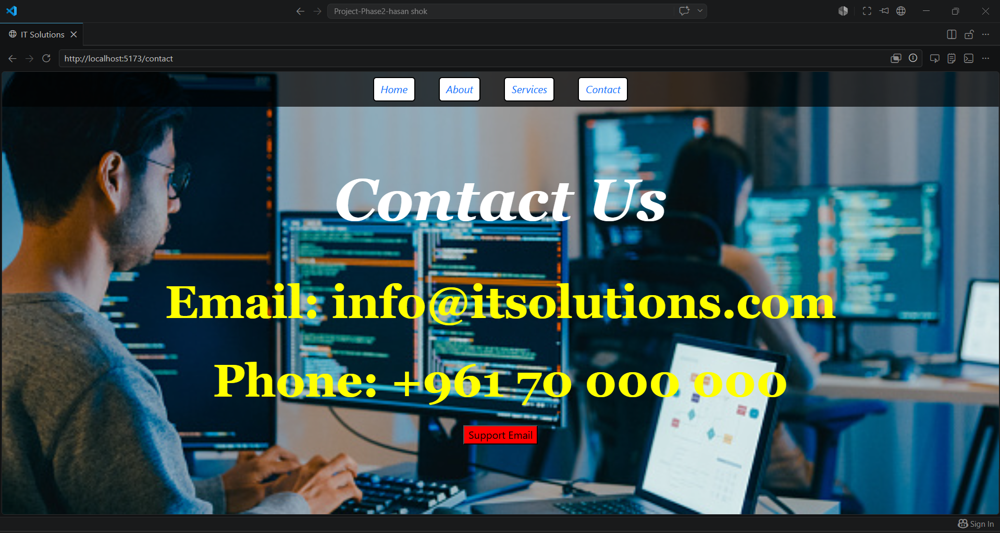
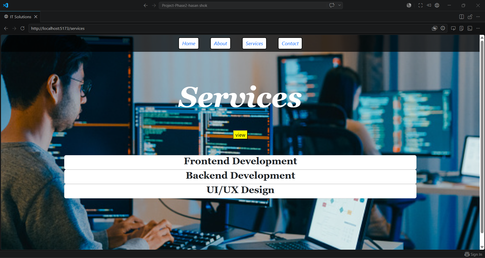
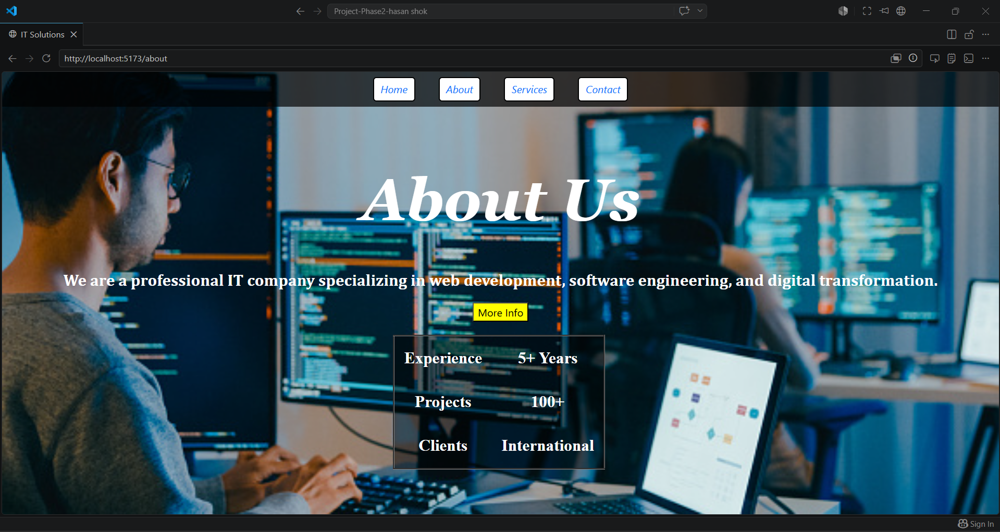

# IT Solutions React Website

## Project Description
This project is a responsive IT company website developed using ReactJS and Bootstrap. It includes multiple pages such as Home, About, Services, and Contact.

## Technologies Used
- ReactJS
- Bootstrap
- CSS
- JavaScript
- React Router

## Features
- Responsive design
- Multi-page navigation
- useState and useEffect hooks
- Modern UI

## Setup Instructions
1. Install dependencies:
npm install

2. Run the project:
npm run dev

## Screenshots

Hassan Chok 
## Live Demo
https://it-solutions-react-project.vercel.app/

